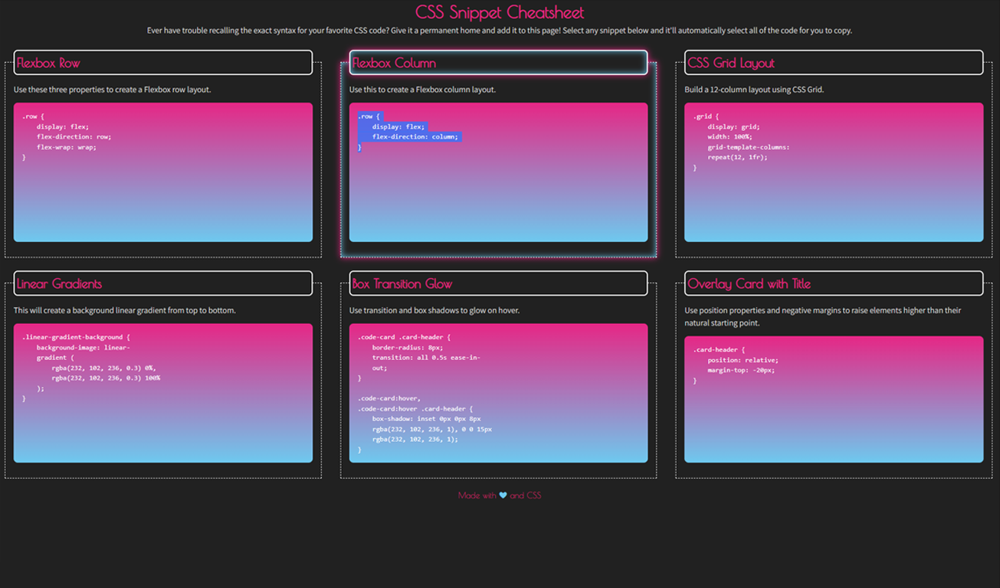
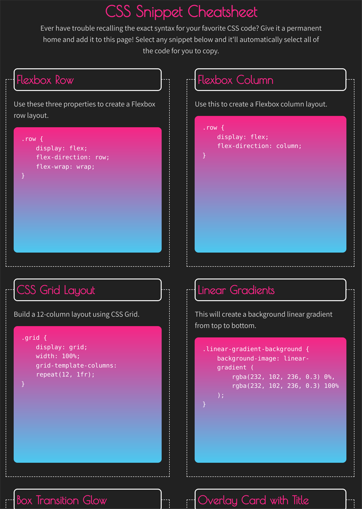
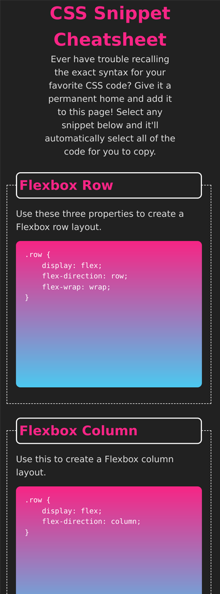

# CSS Snippet Cheatsheet

  

---

## Description

<ul>
    <li>For this project my goal was to create a grid layout for a CSS code Cheatsheet.</li>
    <li>I used CSS Grid, a linear-gradient, user-select property, and a box-shadow for the hover transition.</li>
    <li>The work I have completed provides a visually pleasing layout with a few CSS code reminders!</li>
    <li>During this project I learn that flex can be used with CSS Grid to aid in positioning.</li>
</ul>

---

## Link

https://mahiv87.github.io/CSS-Snippet-Cheatsheet/
---

## Mock-up

---
